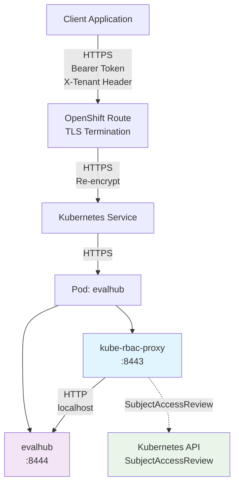
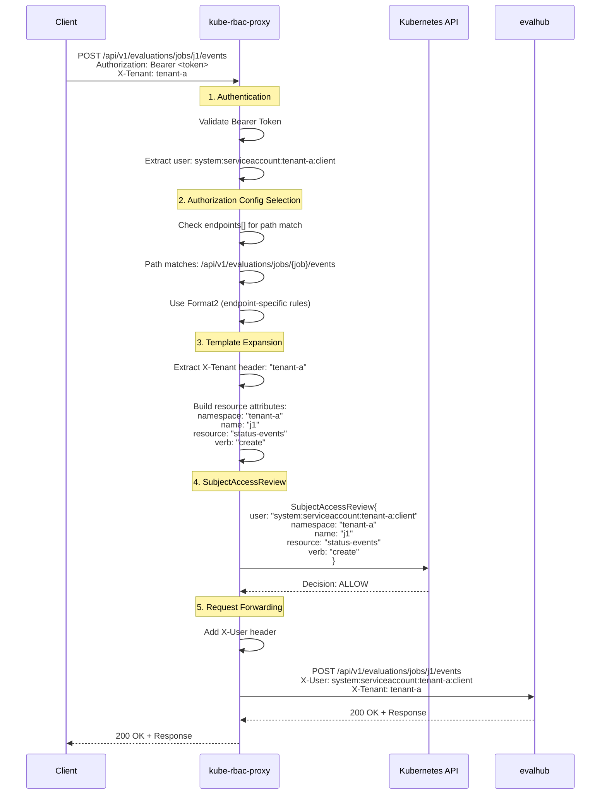
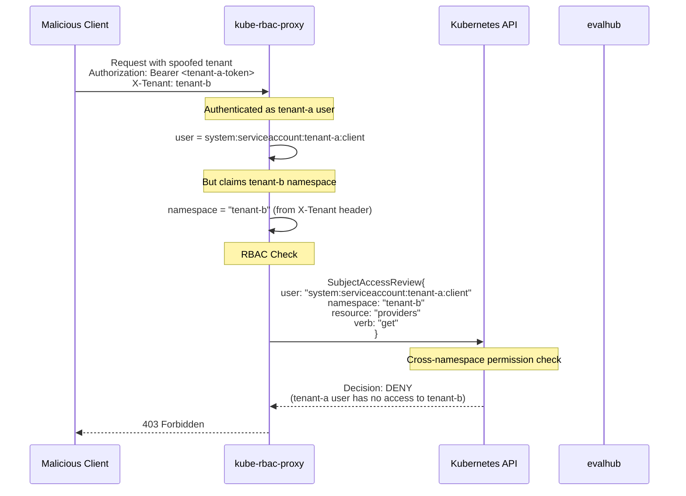
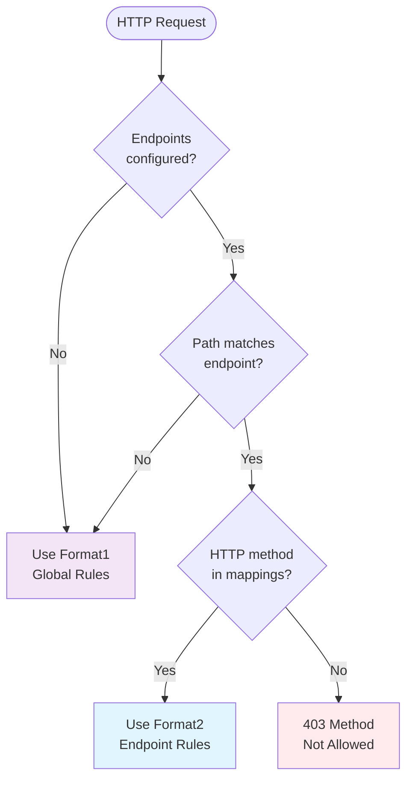
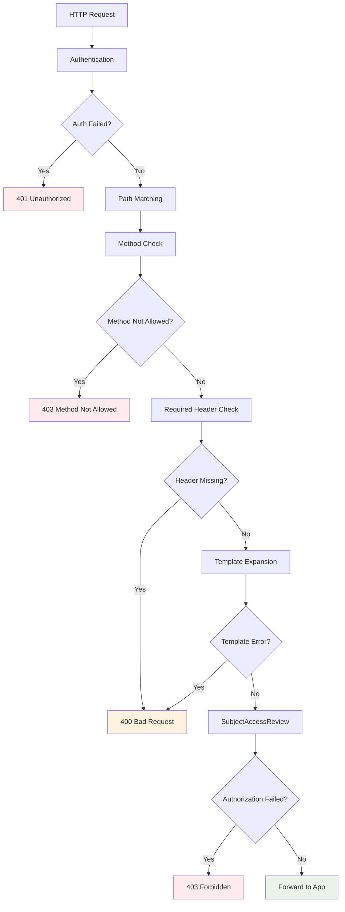

# Tenant Architecture: Per-Endpoint Authorization in kube-rbac-proxy

## Overview

This document analyzes the tenant architecture introduced in PR #16, which adds support for per-endpoint authorization rewrites. The enhancement enables path-specific and HTTP method-specific authorization rules while maintaining backward compatibility.

## Authorization Formats

### Format1 (Global Fallback)
```yaml
authorization:
  rewrites:
    byHttpHeader:
      name: X-Tenant
  resourceAttributes:
    namespace: "{{ .Value }}"
    apiGroup: trustyai.opendatahub.io
    resource: providers
    verb: get
```

Endpoint path segments support two forms:

- `*` is the legacy match-only placeholder. It matches exactly one segment and is not exposed to templates.
- `{name}` is a named capture. It matches exactly one segment and is available as `{{ index .PathParams "name" }}`.

For example:

```yaml
authorization:
  endpoints:
    - path: /api/v1/jobs/*/{id}
      mappings:
        - methods: [get]
          resources:
            - resourceAttributes:
                apiGroup: batch.example.io
                resource: jobs
                name: '{{ index .PathParams "id" }}'
                verb: get
```

For `/api/v1/jobs/queue/123`, the `*` segment matches `queue` and `{id}` captures `123`. Multiple named captures are supported; capture names must be unique within an endpoint.

### Format2 (Endpoint-Specific)
```yaml
authorization:
  endpoints:
    - path: /api/v1/evaluations/jobs/{job}/events
      mappings:
        - methods: [post]
          resources:
            - rewrites:
                byHttpHeader:
                  name: X-Tenant
              resourceAttributes:
                namespace: "{{.FromHeader}}"
                name: '{{ index .PathParams "job" }}'
                apiGroup: trustyai.opendatahub.io
                resource: status-events
                verb: create
```

## Architecture Overview



## Authorization Flow Sequence



## Security Analysis: Tenant ID Spoofing

### Attack Vector


### Protection Mechanism

The Kubernetes RBAC system provides built-in protection against tenant spoofing:

1. **Authentication**: Token identifies the actual user/service account
2. **Authorization**: RBAC checks if the authenticated user has permissions in the claimed namespace
3. **Denial**: Cross-namespace access is denied unless explicitly granted

## RBAC Configuration Examples

### ✅ Secure Configuration (Namespace-Scoped)
```yaml
apiVersion: rbac.authorization.k8s.io/v1
kind: RoleBinding
metadata:
  name: evalhub-permissions
  namespace: tenant-a  # Only grants access to tenant-a
subjects:
- kind: ServiceAccount
  name: evalhub-client
  namespace: tenant-a
roleRef:
  kind: Role
  name: evalhub-role
```

### ❌ Insecure Configuration (Cluster-Wide)
```yaml
apiVersion: rbac.authorization.k8s.io/v1
kind: ClusterRoleBinding
metadata:
  name: evalhub-all-namespaces  # Dangerous: grants access everywhere
subjects:
- kind: ServiceAccount
  name: evalhub-client
  namespace: tenant-a
roleRef:
  kind: ClusterRole
  name: evalhub-cluster-role
```

## Format Selection Logic



## Security Recommendations

### 1. Principle of Least Privilege
- Use namespace-scoped RoleBindings instead of ClusterRoleBindings
- Grant only necessary permissions for each service account
- Regularly audit RBAC configurations

### 2. Tenant Validation Enhancement
```go
func validateTenantClaim(userInfo user.Info, claimedTenant string) error {
    if strings.HasPrefix(userInfo.GetName(), "system:serviceaccount:") {
        parts := strings.Split(userInfo.GetName(), ":")
        if len(parts) >= 3 {
            userNamespace := parts[2]
            if userNamespace != claimedTenant {
                return fmt.Errorf("tenant claim '%s' doesn't match user namespace '%s'", 
                    claimedTenant, userNamespace)
            }
        }
    }
    return nil
}
```

### 3. Zero-Trust Headers
```go
// Derive tenant from authenticated user instead of trusting headers
func getTenantFromUser(userInfo user.Info) string {
    if parts := strings.Split(userInfo.GetName(), ":"); len(parts) >= 3 {
        return parts[2] // Return the namespace portion
    }
    return ""
}
```

### 4. Audit Logging
```go
if authorized != authorizer.DecisionAllow {
    klog.Warningf("Cross-namespace access attempt: user=%s claimed-tenant=%s resource=%s", 
        userInfo.GetName(), claimedTenant, attrs.GetResource())
}
```

## Error Handling Flow



## Performance Considerations

### 1. Endpoint Preprocessing
- `PrepareEndpoints()` splits paths at startup for O(1) segment comparison
- Avoids path splitting on every request

### 2. Template Caching
- Consider caching compiled templates for frequently used patterns
- Template parsing is expensive but expansion is fast

### 3. Request Path Optimization
```go
// Efficient path matching with pre-split segments
func matchEndpoint(requestPath string, endpoint Endpoint) (bool, map[string]string) {
    patternParts := endpoint.PathParts  // Pre-computed at startup
    requestPath = path.Clean(requestPath)
    endpointParts := strings.Split(requestPath, "/")
    
    if len(endpointParts) != len(patternParts) {
        return false  // Early exit for different lengths
    }
    // Literal and '*' segments are matched directly; {name} segments
    // are stored in the returned PathParams map.
}
```

## Testing Strategy

### Test Categories Covered
1. **Path Matching**: Legacy `*` placeholders, named captures, edge cases, normalization
2. **Method Filtering**: Case sensitivity, empty lists, missing methods  
3. **Template Expansion**: Valid syntax, error cases, missing values
4. **Authorization Flow**: End-to-end with real headers and authentication
5. **Error Conditions**: Missing headers, invalid configs, method mismatches

### Integration Test Results
- ✅ 10/10 test scenarios passed
- ✅ Authentication, authorization, and header forwarding verified
- ✅ Both Format1 and Format2 configurations tested successfully
- ✅ Security boundaries confirmed (unauthorized access blocked)

## Risk Assessment

Path captures and rewrite values are expected inputs to this feature. They do not
grant access by themselves: kube-rbac-proxy submits the selected namespace and
resource name in a SAR for the already authenticated user, and Kubernetes RBAC
still makes the authorization decision. The relevant risk is configuration that
trusts a client-controlled header as an identity boundary or grants the caller
permissions broader than intended.

| Risk Level | Scenario | Mitigation |
|------------|----------|------------|
| 🟢 **Low** | Proper RBAC with namespace-scoped permissions | Standard configuration |
| 🟡 **Medium** | Information disclosure via error messages | Sanitize error responses |
| 🔴 **High** | Overly broad ClusterRoleBindings | RBAC auditing and validation |
| 🟡 **Medium** | Client-controlled rewrite header used as a trusted identity boundary | Strip/overwrite the header at a trusted ingress, or derive the tenant from authenticated identity |
| 🟡 **Medium** | Ambiguous or overlapping endpoint patterns | Prefer specific literal prefixes and review endpoint ordering |

## Conclusion

The per-endpoint authorization feature provides significant flexibility for multi-tenant environments while maintaining security through Kubernetes RBAC. The dual-format approach ensures backward compatibility while enabling fine-grained access control. Proper RBAC configuration is critical for preventing cross-tenant access, and additional validation layers are recommended for defense in depth.
